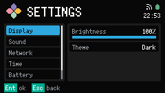
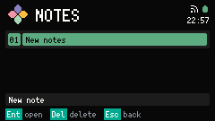
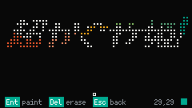

<p align="center">
  
</p>

<div align="center">
  <h1>LUMA</h1>
  <p>Multi-application firmware for the M5Stack Cardputer ADV</p>
</div>

<p align="center">
  <a href="https://github.com/zhoux77899/luma/releases"></a>
  <a href="https://github.com/zhoux77899/luma/blob/main/LICENSE"></a>
  
  
</p>

LUMA is firmware for the M5Stack Cardputer ADV. After the Boot screen, Launcher
opens Settings, Notes, and DOTS.

The [User guide](https://zhoux77899.github.io/luma/) covers flashing and each
App in [English](https://zhoux77899.github.io/luma/en/) and
[简体中文](https://zhoux77899.github.io/luma/zh/). Source Markdown stays in
[docs/user-manual](docs/user-manual/README.md).

| App | What it does | Screen |
| --- | --- | --- |
| Launcher | Opens registered Apps with directional navigation and confirm. The Header shows LUMA, network and battery glyphs, and civil time. |  |
| Settings | Edits Display (brightness, Dark/Light Theme), Sound (Volume), Network (Wi-Fi Status, Saved, Scan), Time (Time zone), Battery (charge and one-hour history), and System → About (Build identity, Cardputer ADV, repository). |  |
| Notes | Lists Notes and edits one Notes document at a time. The first line is the Note title. Leaving the editor saves. An empty Note is discarded. Notes keeps at most sixteen. |  |
| DOTS | Lists Matrices and paints one 60×30 Matrix of LED cells at a time. Confirm paints the current Pen color. Delete extinguishes the cell. DOTS keeps at most sixteen Matrices. |  |

## Choose a path

| Goal | Start here |
| --- | --- |
| Read the User guide | [English](https://zhoux77899.github.io/luma/en/) · [简体中文](https://zhoux77899.github.io/luma/zh/) · [source](docs/user-manual/README.md) |
| Use LUMA on a Cardputer ADV | [Flash a release](#flash-a-release) |
| Build or test the firmware | [Build from source](#build-from-source) |
| Inspect the UI without hardware | [SDL preview](#sdl-preview) |

## Requirements

| Workflow | System requirements | Project dependencies | Hardware |
| --- | --- | --- | --- |
| Build firmware | Python 3.11 | PlatformIO 6.1.19 from [`requirements.txt`](requirements.txt); Arduino and `M5Cardputer` are resolved by PlatformIO | None |
| Run native tests | Python 3.11 and a C++17 host compiler | PlatformIO 6.1.19 | None |
| Flash a release | Python 3.11 | `esptool` | M5Stack Cardputer ADV and a data-capable USB-C cable |
| Upload and monitor | Python 3.11 | PlatformIO 6.1.19 | M5Stack Cardputer ADV and a data-capable USB-C cable |
| Run the SDL preview | CMake 3.16 or newer and a C++17 compiler | Bootstrapped [vcpkg](https://github.com/microsoft/vcpkg); SDL2 from `tools/sdl-preview/vcpkg.json` | None |

From the repository root, with `python` pointing at Python 3.11:

```bash
python -m pip install -r requirements.txt
```

Manual release flashing also needs `esptool`:

```bash
python -m pip install esptool
```

If `python` is not 3.11, use `py -3.11` on Windows or `python3.11` on macOS/Linux.
PlatformIO downloads the Arduino framework and `M5Cardputer` on the first firmware
build. If Windows cannot find a native test compiler, add PlatformIO's MinGW to
`PATH` before `pio test -e native`:

```powershell
$mingwBin = Join-Path $env:USERPROFILE ".platformio\packages\toolchain-gccmingw32\bin"
$env:PATH = $mingwBin + [System.IO.Path]::PathSeparator + $env:PATH
```

The SDL preview uses `x64-windows`, `arm64-osx`, `x64-osx`, or `x64-linux`. Install
and bootstrap vcpkg from its [official instructions](https://learn.microsoft.com/vcpkg/get_started/overview)
before the SDL commands.

## Flash a release

Release images are on the [GitHub Releases page](https://github.com/zhoux77899/luma/releases).
They target the M5Stack Cardputer ADV (ESP32-S3, 8 MB flash). Do not flash them to
another board. Download the merged image and `SHA256SUMS`.

### Verify the download

Compare the hash with the matching line in `SHA256SUMS`.

Windows PowerShell:

```powershell
Get-FileHash .\luma-cardputer-vX.Y.Z-merged.bin -Algorithm SHA256
```

macOS:

```bash
shasum -a 256 luma-cardputer-vX.Y.Z-merged.bin
```

Linux:

```bash
sha256sum --ignore-missing -c SHA256SUMS
```

Install `esptool` as described in [Requirements](#requirements).

### Enter download mode

Power off the Cardputer ADV, hold **G0** while reconnecting a data-capable USB-C cable,
then release **G0**.

### Flash the merged image

The merged image is the complete 8 MB flash image and must be written at address
`0x00000000`:

```bash
esptool.py --chip esp32s3 write_flash 0x00000000 luma-cardputer-vX.Y.Z-merged.bin
```

If `esptool.py` is not on `PATH`, use `py -3.11 -m esptool` on Windows or
`python3.11 -m esptool` on macOS/Linux. If automatic port detection fails, add
`--port <PORT>` (for example, `COM5`, `/dev/cu.usbmodem*`, or `/dev/ttyUSB0`).

The release Flash package has the split images, addresses in `flash.json`,
`FLASHING.md`, and checksums.

## Build from source

```bash
pio run -e m5stack-cardputer
pio test -e native
```

The Cardputer environment uses the generic `esp32-s3-devkitc-1` board definition,
LittleFS, USB CDC on boot, and C++17. Native tests run the shared Core on the host
and skip the Cardputer adapters. See [Requirements](#requirements) for the Windows
compiler workaround.

Connect the Cardputer ADV with a data-capable USB-C cable and upload the local build:

```bash
pio run -e m5stack-cardputer --target upload
```

If the board is not detected, power it off, hold **G0** while reconnecting USB-C,
release **G0**, and retry. Uploading changes the connected device. Use a release image
if you do not intend to build from source.

Serial monitor is 115200 baud:

```bash
pio device monitor
```

A successful cold boot shows the Boot screen, then Launcher. Serial output starts
with `[BOOT] Luma Cardputer ADV started`. App transitions emit `[APP]` lines. Key
diagnostics use the `[KEY]` prefix.

## SDL preview

The SDL preview shows the same Core and Apps on the host. Set `VCPKG_ROOT` to a
bootstrapped vcpkg tree. CMake installs SDL2 from `tools/sdl-preview/vcpkg.json`.
Pass `-DVCPKG_TARGET_TRIPLET=arm64-osx` on Apple Silicon or `x64-osx` on Intel Macs
when you need to pick a triplet. See [Requirements](#requirements) for CMake,
compiler, and vcpkg.

Windows PowerShell:

```powershell
$env:VCPKG_ROOT = "C:\path\to\vcpkg"
cmake -S tools/sdl-preview -B build/sdl-preview -DCMAKE_TOOLCHAIN_FILE="$env:VCPKG_ROOT/scripts/buildsystems/vcpkg.cmake"
```

macOS / Linux:

```bash
export VCPKG_ROOT="/path/to/vcpkg"
cmake -S tools/sdl-preview -B build/sdl-preview \
    -DCMAKE_TOOLCHAIN_FILE="$VCPKG_ROOT/scripts/buildsystems/vcpkg.cmake"
```

```bash
cmake --build build/sdl-preview --config Debug --target luma-sdl-preview
```

Run the executable from the build directory so the preview writes data to `data/`.

Windows PowerShell:

```powershell
Set-Location build/sdl-preview
.\Debug\luma-sdl-preview.exe
```

macOS / Linux:

```bash
cd build/sdl-preview
./luma-sdl-preview
```

The preview window is 960 x 540 with a 240 x 135 Preview canvas and integer 4x
nearest-neighbor scaling. Arrow keys, Enter, Escape, Backspace/Delete, Page Up/Page
Down, and printable characters map to `InputFrame` values.

## User guide site

The published User guide is assembled from `docs/user-manual/` on main (`latest`)
and from each GitHub Release tag. Preview it locally:

```bash
cd site
npm ci
npm run dev
```

The GitHub Pages site uses `https://zhoux77899.github.io/luma/`. Enable Pages
with Source = GitHub Actions if the deploy workflow has not been allowed yet.

## Project layout

- `include/luma` and `src/luma`: platform-independent Core, Apps, and UI.
- `src/luma/platform/cardputer`: Cardputer hardware adapters and factory.
- `src/luma/platform/host`: host storage, clock, audio, and diagnostics adapters.
- `tools/sdl-preview`: CMake target and SDL display/input adapters.
- `site`: User guide site (Vite + React + beUI).
- `test`: native Core tests.
- `partitions/luma-8mb.csv`: the Cardputer ADV 8 MB partition layout.

Architecture decisions and visual design tokens are in [`docs/adr`](docs/adr) and
[`DESIGN.md`](DESIGN.md).

## Contributing

See [`CONTRIBUTING.md`](CONTRIBUTING.md) for commit and pull request conventions.
Coding agents should read [`AGENTS.md`](AGENTS.md) before editing this repository.

## License

LUMA is released under the [MIT License](LICENSE).
