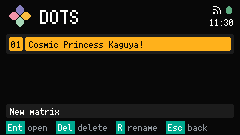

# DOTS

DOTS lists Matrices and paints one Matrix of LED cells at a time. A Matrix is 60 by 30. Open DOTS from [Launcher](launcher.md).

## Matrix list

Saved Matrices appear newest-modified first, each as an index chip and a name chip. New matrix stays pinned at the bottom.

Up and Down move the selection. Confirm on a Matrix opens paint. Confirm on New matrix opens an empty paint view named `Untitled`.

Delete on a Matrix asks `Delete?`. Confirm deletes it. Esc cancels.

`R` on a Matrix opens rename. Type a name and Confirm. Esc keeps the old name. A name must be unique. An empty field becomes `Untitled` (or `Untitled 2`, and so on).

DOTS keeps at most sixteen Matrices. When the list is full, New matrix shows `FULL` and does not create another.

Footer on a Matrix: `Ent open`, `Del delete`, `R rename`, `Esc back`.

Footer on New matrix: `Ent new`, `Esc back`.

## Paint

The paint view is the 60 by 30 grid. Off cells stay dark. A lit cell is a Dot in the current Pen color. The Matrix cursor is the outlined cell. The Footer shows its coordinates and a swatch of the Pen color.

Arrows move the cursor. Confirm paints the cell (`Ent paint`). Delete extinguishes it (`Del erase`). Off is not a Pen color.

The Footer has two pages. The first page is `Ent paint`, `Del erase`, and `Esc back`. After about five seconds it shows `C color` and `X clear`.

`C` opens the Pen color picker. `X` asks before clearing every cell. Confirm clears. Esc cancels. There is no screenshot of the clear dialog.

Esc leaves paint. A new Matrix with no lit cells is discarded. A Matrix still named `Untitled` that has lamps asks for a name before returning to the list. Esc on that prompt keeps `Untitled`. There is no screenshot of the name prompt.

If a save fails, the Footer shows `SAVE FAIL`.

## Pen color

The picker is a row of 13 colors. Left and Right move the selection. Confirm sets the Pen color and returns to paint. Esc returns without changing it.

Footer: `Ent ok`, `Esc back`.
