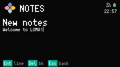

# NOTES

Notes lists Notes and edits one Notes document at a time. Open it from [Launcher](launcher.md).

## Note list

Saved Notes appear newest-modified first, each as an index chip and a Title chip. New note stays pinned at the bottom.

The Note title is the first line of the document. An empty first line shows as `Untitled`.

Up and Down move the selection. Confirm on a Note opens it. Confirm on New note opens an empty editor.

Delete on a Note asks `Delete?`. Confirm deletes it. Esc cancels. There is no screenshot of that dialog.

Notes keeps at most sixteen. When the list is full, New note shows `FULL` in the Footer and does not create another.

Footer on a Note: `Ent open`, `Del delete`, `Esc back`.

Footer on New note: `Ent new`, `Esc back`.

## Editor

The first line is drawn larger. That line is the Note title. The rest is the body.

Type to insert. Arrows move the caret. Confirm inserts a line break (`Ent line`). Delete removes the character before the caret (`Del bk`).

Esc leaves the editor and saves. An empty document is discarded, including a new Note you never typed in.

A document holds at most 1024 characters. When it is full, the Footer shows `FULL` instead of the usual hints. If a save fails, the Footer shows `SAVE FAIL`.
