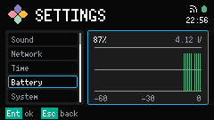

# Battery

Battery is a Settings category. It is not a Launcher App.

Open [Settings](../settings.md) and select Battery. Confirm focuses the history pane.

The pane shows the current percent and voltage when those readings are valid. Otherwise it shows `--`.

The chart is the last hour of Battery history: one sample per minute, up to 60 bars, aligned to now on the right. Empty space on the left is minutes not yet sampled. A new run after startup is a gap. Grid labels mark 0, 50, and 100 percent, and -60, -30, and 0 elapsed minutes.

Bar color follows the same Battery band as the Header glyph: 0-20, 21-30, and 31-100.

LUMA does not show Charging. Cardputer ADV cannot report it.

Footer: `Ent ok`, `Esc back`.
