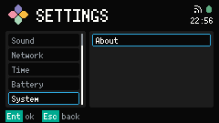
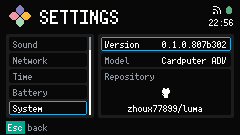

# System

System is a Settings category. Its one row is About.

Open [Settings](../settings.md), select System, then Confirm on About.

## About

About identifies the installed build:

- Version is the Build identity. A release is `X.Y.Z`. An unreleased build is `X.Y.Z.{commit}`.
- Model is `Cardputer ADV`.
- The repository card shows `zhoux77899/luma`.

Up and Down move between those three rows. About does not edit anything.

Footer: `Esc back`.
