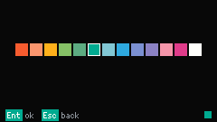

# DOTS

DOTS 列出各个 Matrix，一次只画一个 LED cell（灯点）组成的 Matrix。Matrix 是 60×30。从 [Launcher](launcher.md) 打开 DOTS。

## Matrix list

没有 Matrix list 的截图。布局和 Note list 一样：已保存的 Matrix 按最近修改排在前面，每条是一个序号 chip 和一个名称 chip，New matrix 钉在底部。

上下键移动选择。在一个 Matrix 上 Confirm 进入绘制。在 New matrix 上 Confirm 打开名为 `Untitled` 的空白绘制。

在一个 Matrix 上 Delete 会问 `Delete?`。Confirm 删除，Esc 取消。

在一个 Matrix 上按 `R` 改名。输入名称后 Confirm。Esc 保留原名。名称不能重复。空字段会变成 `Untitled`（或 `Untitled 2`，以此类推）。

DOTS 最多十六个 Matrix。列表满了以后，New matrix 显示 `FULL`，不会再新建。

选中一个 Matrix 时的 Footer：`Ent open`，`Del delete`，`R rename`，`Esc back`。

选中 New matrix 时的 Footer：`Ent new`，`Esc back`。

## 绘制

绘制画面是 60×30 的格子。灭的格子是暗的。亮着的格子是当前 Pen color（笔色）的一个 Dot。Matrix cursor（当前格子）带一圈框。Footer 显示坐标和 Pen color 色块。

方向键移动 cursor。Confirm 涂上当前格（`Ent paint`）。Delete 熄灭它（`Del erase`）。灭不是一种 Pen color。

Footer 有两页。第一页是 `Ent paint`、`Del erase` 和 `Esc back`。大约五秒后出现 `C color` 和 `X clear`。

`C` 打开 Pen color 选择。`X` 会先问再清空所有格子。Confirm 清空，Esc 取消。没有清空对话框的截图。

Esc 离开绘制。新建的 Matrix 如果一盏灯都没点，会被丢掉。仍叫 `Untitled` 但已经有灯的 Matrix，回到列表前会要你起名。在这个提示里按 Esc 仍保留 `Untitled`。没有起名画面的截图。

保存失败时 Footer 显示 `SAVE FAIL`。

## Pen color

选择器是一行 13 种颜色。左右键移动选择。Confirm 设好 Pen color 并回到绘制。Esc 不改颜色就返回。

Footer：`Ent ok`，`Esc back`。
