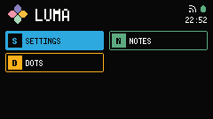

# LAUNCHER

Launcher 是 Boot screen 之后的界面，从这里打开其它 App。Header（顶栏）写的是产品名 LUMA，不是 LAUNCHER。

## Header

左边是 Logo 和 LUMA。

右边是 Header status cluster（顶栏状态区）：网络符号、电池符号，下面是 civil time（本地时刻）。

LUMA 知道 RSSI 时，网络符号是四档信号。同一标记加上斜杠表示站点未连接。Header 不显示 dBm。

电池符号有六档填充。颜色跟 Battery band（电量色带）走：低电量偏红，下一档偏黄，其余偏绿。Header 不显示百分比。也不显示 Charging。Cardputer ADV 报不了充电状态。

civil time 是 24 小时的 `HH:MM`。Clock 同步之前一直是空的。同步之后，短暂断线仍保留上次有效时刻。

## App card

Launcher 给每个已注册 App 一张 App card（打开 App 的格子）。卡片是 SETTINGS、NOTES、DOTS 和 REMOTE。Launcher 自己不是一张 card。

每张 card 有 Accent（强调色）和一个字母。选中的 card 用该 Accent 填满。

方向键在两列网格里移动。Confirm 打开选中的 App。没有字母快捷键。

从其它 App 按 Esc 回到这里。Launcher 没有 Footer。

- [Settings](settings.md)
- [Notes](notes.md)
- [DOTS](dots.md)
- [REMOTE](remote.md)
