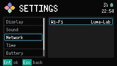
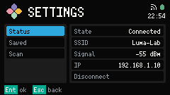
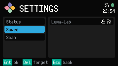
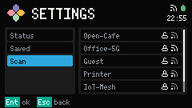

# Network

Network 是一个 Settings category。真正管 Wi-Fi 的是 Core 里的 Network 服务。本页是编辑它的那个类别。

打开 [Settings](../settings.md)，选 Network，再在 Wi-Fi 这一行按 Confirm。

Wi-Fi 行显示当前状态。已连接时显示 SSID。其它状态是 Connecting、Failed、Disconnected 或 Unknown。

Confirm 打开 Wi-Fi 的嵌套分栏：Status、Saved 和 Scan。

## Status

站点已连接时，Status 列出 State、SSID、以 dBm 计的 Signal、IP，以及 Disconnect。在 Disconnect 上 Confirm 会断开。断开之后，LUMA 不会重连，直到你再次连接或重启。

未连接时，Status 只显示 State。

Footer：`Ent ok`，`Esc back`。

## Saved

Saved 列出 Wi-Fi profile（已记住的网络）。LUMA 最多留五条。只有连接成功才会存成 profile。在一行上 Confirm 会连上该 profile 并回到 Status。

`Del forget` 删掉当前这条。

空列表显示 `No saved`。

## Scan

在 Scan 上 Confirm 开始扫描。扫描中列表显示 `Scanning`。什么都没扫到就显示 `No networks`。

每条结果显示 SSID；加密网络有锁，旁边是信号符号。对开放网络 Confirm 会立刻连接并回到 Status。

对加密网络 Confirm 会打开密码框。没有这张截图。画面上有 SSID、用星号遮住的 Password 行，以及字数。输入密码后 Confirm（`Ent join`）去连接，Delete 删一个字符，Esc 回到 Scan。没连上的密码是 pending credential（尚未生效的密码），Failed 时丢掉，不会变成 profile。

从某个 Wi-Fi section 按 Esc 回到 section 列表。再按 Esc 回到 Network 这个 category。
