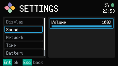

# Sound

Sound 是一个 Settings category。打开 [Settings](../settings.md)，选 Sound，再 Confirm 进入 Detail pane。

## Volume

Volume 是 0 到 100 的界面音量。0 会关掉 UI 声音。左右键每次改 10。`-` / `_` 和 `=` / `+` 一样。条子会马上更新。改完会按新音量响一声，Volume 为 0 时不响。

Footer：`Ent ok`，`Esc back`。
