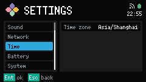
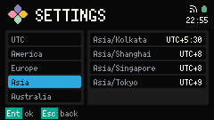

# Time

Time 是管 civil-time（本地时刻）偏好的 Settings category。它不是 Clock 服务。

打开 [Settings](../settings.md)，选 Time，再在 Time zone 上 Confirm。

Time zone 行显示当前的 IANA id，例如 `Asia/Shanghai`。

## Time zone

嵌套分栏左边是 Time zone section（时区分组）：UTC、America、Europe、Asia、Australia。Confirm 进入右边的列表，再 Confirm 某一条来应用。

每条显示 id 和 UTC 偏移标签。

Clock 用这个选择来算 Header 里的 civil time。Clock 同步之前，时刻一直是空的。

Footer：`Ent ok`，`Esc back`。
